# Senior Career Day - Workshop2020
Today will be using the MVC framework of Django to build a simple blog website.

## Prerequisites
Make sure you have either Python3 or Docker installed on your computer.

## Get Started
### Clone the project and checkout the 'clean_slate' branch

    git clone https://github.com/rockstardotb/django-customizable-blog.git
    git checkout clean_slate
    cd django-customizable-blog/django-customizable-blog/
    
### Next, if you are NOT using Docker, we will want to create a virtual environment so any dependencies that we install will be limited to that environment.

#### On Windows
    virtualenv env
    cd env
    Scripts\activate.bat
    cd ../
    pip install -r requirements.txt

#### On Mac/Linux
    python3 -m venv .env
    source .env/bin/activate
    pip install -r requirements.txt

### Else
    make build
    make run
    make exec

## Create Project
    django-admin startproject website
    
## Create the Blog app
    cd website
    python manage.py startapp blog
    
Your directory structure should look like this:

    ├── website
    │   ├── __init__.py
    │   ├── settings.py
    │   ├── urls.py
    │   └── wsgi.py
    ├── manage.py
    └── blog
        ├── __init__.py
        ├── admin.py
        ├── apps.py
        ├── models.py
        ├── tests.py
        └── views.py
    
## Add Blog app to website/settings.py

    INSTALLED_APPS = [
        'django.contrib.admin',
        'django.contrib.auth',
        'django.contrib.contenttypes',
        'django.contrib.sessions',
        'django.contrib.messages',
        'django.contrib.staticfiles',
        'blog'
    ]
    
### Migrate changes to the database
    python manage.py migrate
  
### Add 0.0.0.0 to "ALLOWED_HOSTS" in website/settings.py
    ALLOWED_HOSTS = ["0.0.0.0"]

### Now let us test our site by running the server
    python manage.py runserver 0.0.0.0:8000
    
If you visit 0.0.0.0:8000 in your browser, you should see this:

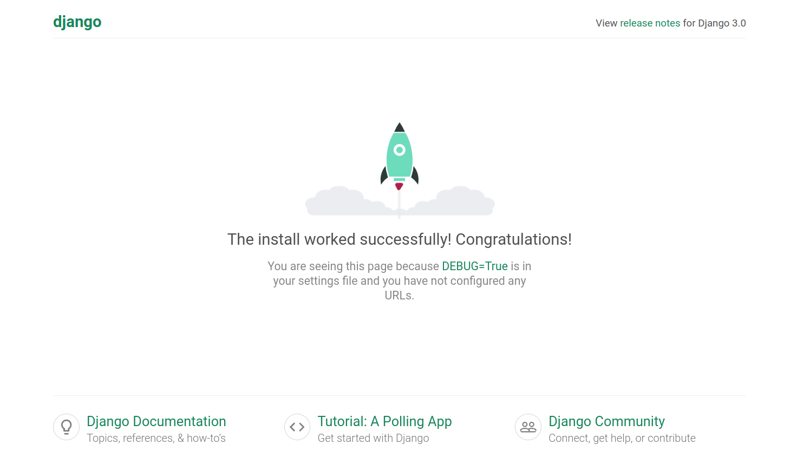

### Now we need to define models in our database (blog/models.py)
    from django.db import models
    from django.contrib.auth.models import User

    STATUS = (
        (0,"Draft"),
        (1,"Publish")
    )

    class Post(models.Model):
        title = models.CharField(max_length=200, unique=True)
        slug = models.SlugField(max_length=200, unique=True)
        author = models.ForeignKey(User, on_delete= models.CASCADE,related_name='blog_posts')
        updated_on = models.DateTimeField(auto_now= True)
        content = models.TextField()
        created_on = models.DateTimeField(auto_now_add=True)
        status = models.IntegerField(choices=STATUS, default=0)

        class Meta:
            ordering = ['-created_on']

        def __str__(self):
            return self.title

#### And we need to migrate these changes
    python manage.py makemigrations
    python manage.py migrate

### Now we are going to edit the prebuilt admin portal, but first we need to create an admin account
    python manage.py createsuperuser
    
    Username (leave blank to use 'root'): admin
    Email address: admin@gamil.com
    Password: 
    Password (again):
    
### Visit the admin portal at 0.0.0.0:8000/admin
Log in using your credentials

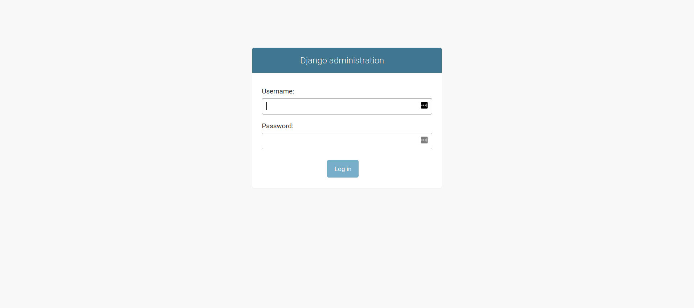

Once you have logged in, you will see the admin portal

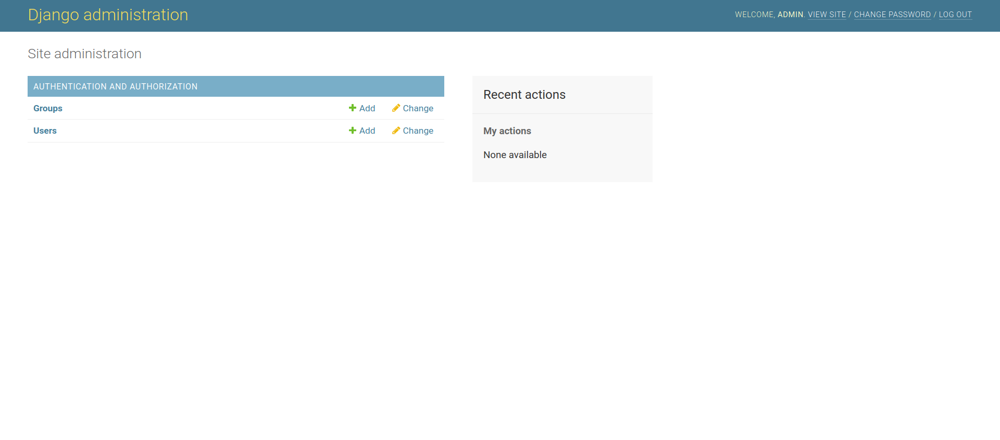

### Next we want to register our Post model with the admin portal. In blog/admin.py add the following:
    from django.contrib import admin
    from .models import Post 

    # customizes the appearance of our model in the admin view
    class PostAdmin(admin.ModelAdmin):
        list_display = ('title', 'slug', 'status','created_on')
        list_filter = ("status",)
        search_fields = ['title', 'content']
        prepopulated_fields = {'slug': ('title',)}

    # registers the model and its customizations with the admin portal
    admin.site.register(Post, PostAdmin)

Now, if we create a post, we will see it in our admin portal

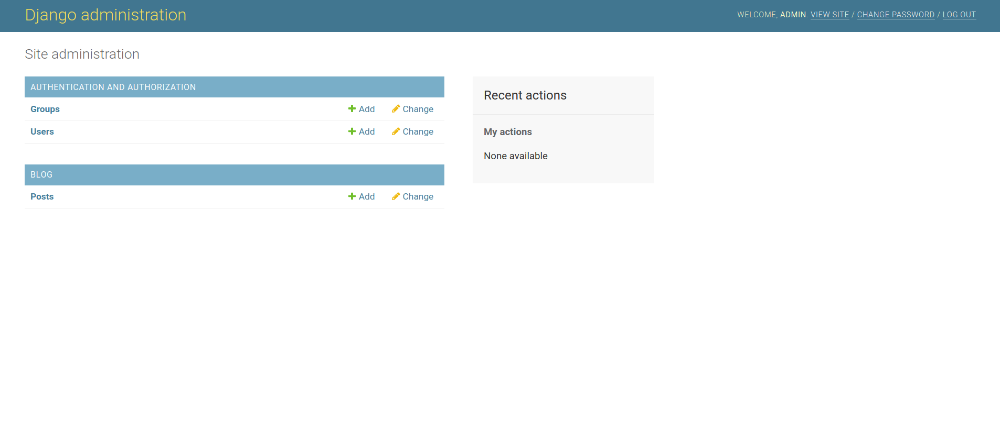

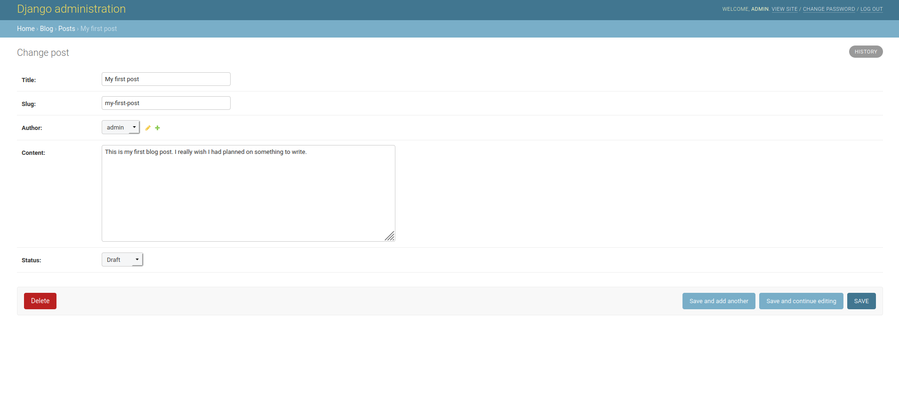

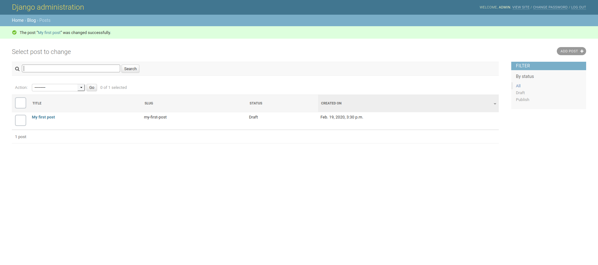

### Next we will create our views. In blog/views.py add the following:
    from django.views import generic
    from .models import Post

    class PostList(generic.ListView):
        # Only show posts with a status=1, i.e. published
        queryset = Post.objects.filter(status=1).order_by('-created_on')
        template_name = 'index.html'

    class PostDetail(generic.DetailView):
        model = Post
        template_name = 'post_detail.html'

### Now, create a urls.py in the blog/ and add the following:
    from . import views
    from django.urls import path

    urlpatterns = [
        path('', views.PostList.as_view(), name='home'),
        path('<slug:slug>/', views.PostDetail.as_view(), name='post_detail'),
    ]
    
Now our structure looks like this:

    ├── db.sqlite3
    ├── website
    │   ├── __init__.py
    │   ├── settings.py
    │   ├── urls.py
    │   └── wsgi.py
    ├── manage.py
    └── blog
        ├── __init__.py
        ├── admin.py
        ├── apps.py
        ├── migrations
        │   └── __init__.py
        ├── models.py
        ├── tests.py
        ├── urls.py
        └── views.py

### Let us register our blog urls with admin urls in website/urls.py by adding the following:
    from django.contrib import admin
    from django.urls import path, include

    urlpatterns = [
        path('admin/', admin.site.urls),
        path('', include('blog.urls')),
    ]

### Next we will create our HTML templates. First, we will need to create a template directory and define it in website/settings.py
Create the templates directory at the same level as the project and app. Then, in website/settings.py,
Add

    TEMPLATES_DIR = os.path.join(BASE_DIR,'templates')

below BASE_DIR (around line number 17)

Add TEMPLATES_DIR to the 'DIRS' list in the TEMPLATES LIST (around line number 59)

    TEMPLATES = [
        {
            'BACKEND': 'django.template.backends.django.DjangoTemplates',
            #  Add  'TEMPLATES_DIR' here
            'DIRS': [TEMPLATES_DIR],
            'APP_DIRS': True,
            'OPTIONS': {
                'context_processors': [
                    'django.template.context_processors.debug',
                    'django.template.context_processors.request',
                    'django.contrib.auth.context_processors.auth',
                    'django.contrib.messages.context_processors.messages',
                ],
            },
        },
    ]
    
Now our structure looks like this:

    ├── db.sqlite3
    ├── templates
    │   ├── base.html
    │   ├── index.html
    │   └── post_detail.html
    ├── website
    │   ├── __init__.py
    │   ├── settings.py
    │   ├── urls.py
    │   └── wsgi.py
    ├── manage.py
    └── blog
        ├── __init__.py
        ├── admin.py
        ├── apps.py
        ├── migrations
        │   └── __init__.py
        ├── models.py
        ├── tests.py
        ├── urls.py
        └── views.py
        
We want to create three templates. One serves as a template for all other templates, i.e. includes navbars, footers, styling, etc.
We'll call it base.html:

    <!DOCTYPE html>
    <html>

        <head>
            <title>Django Central</title>
            <link href="https://fonts.googleapis.com/css?family=Roboto:400,700" rel="stylesheet">
            <meta name="google" content="notranslate" />
            <meta name="viewport" content="width=device-width, initial-scale=1" />
            <link rel="stylesheet" href="https://maxcdn.bootstrapcdn.com/bootstrap/4.0.0/css/bootstrap.min.css" integrity="sha384-Gn5384xqQ1aoWXA+058RXPxPg6fy4IWvTNh0E263XmFcJlSAwiGgFAW/dAiS6JXm"
                crossorigin="anonymous" />
        </head>

        <body>
            

            <!-- Navigation -->
            <nav class="navbar navbar-expand-lg navbar-light bg-light shadow" id="mainNav">
                

                    <a class="navbar-brand" href="">Django Blog</a>
                    <button class="navbar-toggler navbar-toggler-right" type="button" data-toggle="collapse" data-target="#navbarResponsive"
                        aria-controls="navbarResponsive" aria-expanded="false" aria-label="Toggle navigation">
                        
                    </button>
                    

                        <ul class="navbar-nav ml-auto">
                            <li class="nav-item text-black">
                                <a class="nav-link text-black font-weight-bold" href="#">About</a>
                            </li>
                            <li class="nav-item text-black">
                                <a class="nav-link text-black font-weight-bold" href="#">Policy</a>
                            </li>
                            <li class="nav-item text-black">
                                <a class="nav-link text-black font-weight-bold" href="#">Contact</a>
                            </li>
                        </ul>
                    

                

            </nav>
            
            <!-- Content Goes here -->
            
            <!-- Footer -->
            <footer class="py-3 bg-grey">
                
Copyright &copy; Django Blog

            </footer>
        </body>
    </html>

Next, we'll create the index.html, which will extend the base.html:

     
    
    

    <header class="masthead">
        

        

            

                

                    

                        <h3 class=" site-heading my-4 mt-3 text-white"> Welcome to my awesome Blog </h3>
                    

                

            

        

    </header>
    

        

            <!-- Blog Entries Column -->
            

                
                

                    

                        <h2 class="card-title">{{ post.title }}</h2>
                        
{{ post.author }} | {{ post.created_on}} 

                        
{{post.content|slice:":200" }}

                        <a href="" class="btn btn-primary">Read More &rarr;</a>
                    

                

                
            

            

            <!-- Sidebar Widgets Column -->
            

            

                    <h5 class="card-header">About Us</h5>
                

                    
 This awesome blog is made on the top of our Favourite full stack Framework 'Django', follow up the tutorial to learn how we made it..!

                    <a href="https://github.com/rockstardotb/workshop2020/blob/master/README.md"
                       class="btn btn-danger">Know more!</a>
                

            

            

        

    

    
    

Finally, we'll create the Post detail template.

     

    

      

        

          

            <h1> {{ object.title }} </h1>
            
{{ object.author }} | {{ object.created_on }}

            
{{ object.content | safe }}

          

        

      

    

    

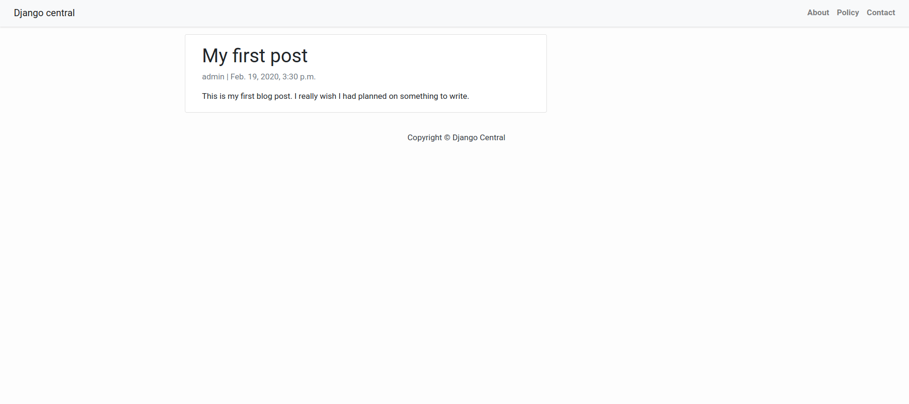

## What if you were creating this site for someone who has zero programming experience and they want to have the ability to customize things such as color palettes, background image/color, and font type?
# Add customization models that can be used in the admin portal to customize the blog's appearance.
### Add the following models to blog/models.py:

    from django.db import models
    from django.contrib import admin
    import uuid
    from django import forms
    from django.utils.html import format_html_join
    from django.utils.safestring import mark_safe
    from django.contrib.auth.models import User

    STATUS = (
        (0,"Draft"),
        (1,"Publish")
    )

    class Post(models.Model):
        title = models.CharField(max_length=200, unique=True)
        slug = models.SlugField(max_length=200, unique=True)
        author = models.ForeignKey(User, on_delete= models.CASCADE,related_name='blog_posts')
        updated_on = models.DateTimeField(auto_now= True)
        content = models.TextField()
        created_on = models.DateTimeField(auto_now_add=True)
        status = models.IntegerField(choices=STATUS, default=0)

        class Meta:
            ordering = ['-created_on']

        def __str__(self):
            return self.title

    class BackgroundImage(models.Model):
        background_image_id = models.UUIDField(primary_key=True, default=uuid.uuid4, editable=False)

        background_image =  models.FileField(upload_to='./images', blank=True,unique=True)
        def __str__(self):
            return str(self.background_image)

    class ColorPalette(models.Model):
        color_palettes_id = models.UUIDField(primary_key=True,default=uuid.uuid4, editable=False)
        text_color = models.CharField(max_length=25)
        button_color = models.CharField(max_length=25)
        navbar_color = models.CharField(max_length=25)
        name = models.CharField(max_length=25)
        def __str__(self):
            return self.name
        class Meta:
            verbose_name_plural = "ColorPalettes"
    
    class FontTable(models.Model):
        font_id = models.UUIDField(primary_key=True, default=uuid.uuid4, editable=False)
        font_name = models.CharField(max_length=100)
        def __str__(self):
            return self.font_name
    
    class Setting(models.Model):
        settingid = models.UUIDField(primary_key=True, default=uuid.uuid4, editable=False)
        background_image =  models.ForeignKey(BackgroundImage, on_delete=models.CASCADE)
        color_palettes =  models.ForeignKey(ColorPalette, on_delete=models.CASCADE)
        font_type = models.ForeignKey(FontTable, on_delete=models.CASCADE)
    
        class Meta:
            verbose_name_plural = "Settings"
 
### Next, we need to register the models with the admin

    from django.contrib import admin
    from .models import Post, BackgroundImage, ColorPalette, FontTable, Setting
    from django.utils.safestring import mark_safe
    
    class PostAdmin(admin.ModelAdmin):
        list_display = ('title', 'slug', 'status','created_on')
        list_filter = ("status",)
        search_fields = ['title', 'content']
        prepopulated_fields = {'slug': ('title',)}
    
    admin.site.register(Post, PostAdmin)
    
    class BackgroundImageAdmin(admin.ModelAdmin):
        def image(obj):
            return mark_safe("".format(obj.background_image,obj.background_image))
        def file_name(obj):
            return str(obj.background_image)[7:]
    
    
        list_display = [
                       image,
                       file_name,
                       ]
    
    admin.site.register(BackgroundImage, BackgroundImageAdmin)
    
    class ColorPaletteAdmin(admin.ModelAdmin):
        def name(obj):
            return obj.name
        def text_color(obj):
            return mark_safe('<b style="background-color:{}; color:{};">{}</b>'.format(obj.text_color,obj.text_color,"________"))
        def button_color(obj):
            return mark_safe('<b style="background-color:{}; color:{};">{}</b>'.format(obj.button_color,obj.button_color,"________"))
        def navbar_color(obj):
            return mark_safe('<b style="background-color:{}; color:{};">{}</b>'.format(obj.navbar_color,obj.navbar_color,"________"))
        #actions = None
    
        list_display = [
                       name,
                       text_color,
                       button_color,
                       navbar_color,
                       ]
    
    admin.site.register(ColorPalette, ColorPaletteAdmin)
    
    admin.site.register(FontTable)
    admin.site.register(Setting)

## Update the database by running migrations
    python manage.py makemigrations
    python manage.py migrate

## In order for the background images to display in the admin portal, we need to do a couple of things. First, tell Django where to find the images by adding the following to the bottom of website/settings.py:

    STATICFILES_DIRS = [
            os.path.join(BASE_DIR, "static"),
            '/website/images'
            ]
    
    MEDIA_URL = '/images/'
    MEDIA_ROOT = ''

## Next, we need to update the urls in website/urls.py

    from django.contrib import admin
    from django.urls import path, include
    from django.conf.urls.static import static
    from django.conf import settings
    
    urlpatterns = [
        path('admin/', admin.site.urls),
        path('', include('blog.urls')),
    ] + static(settings.MEDIA_URL, document_root=settings.MEDIA_ROOT)

Now we have nice thumbnails for any background images we upload into the admin portal. I like to get my images at https://pixabay.com/

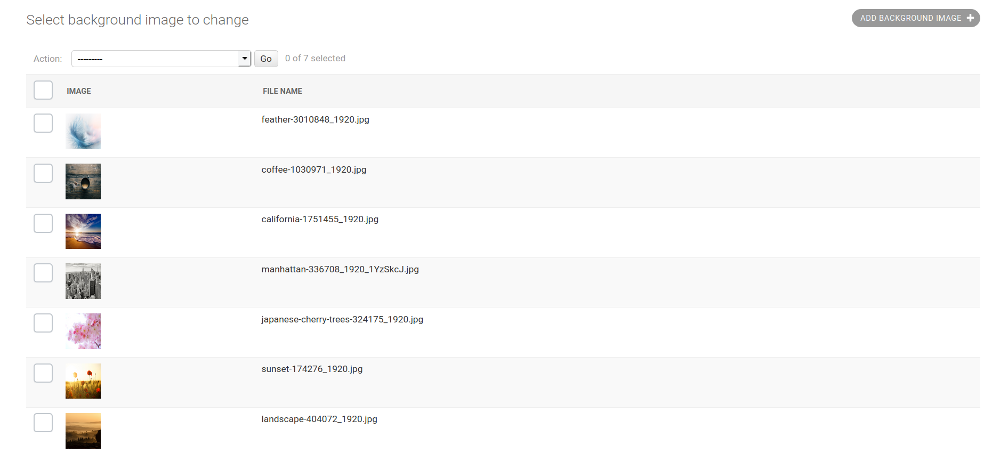

We also now have the ability to enter custom color palettes for styling our blog. I like to choose my color palettes at https://colorhunt.co/

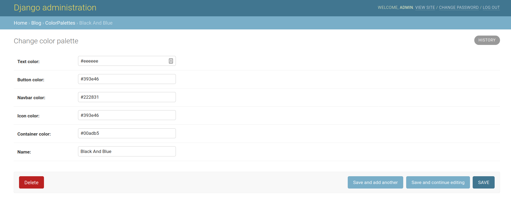
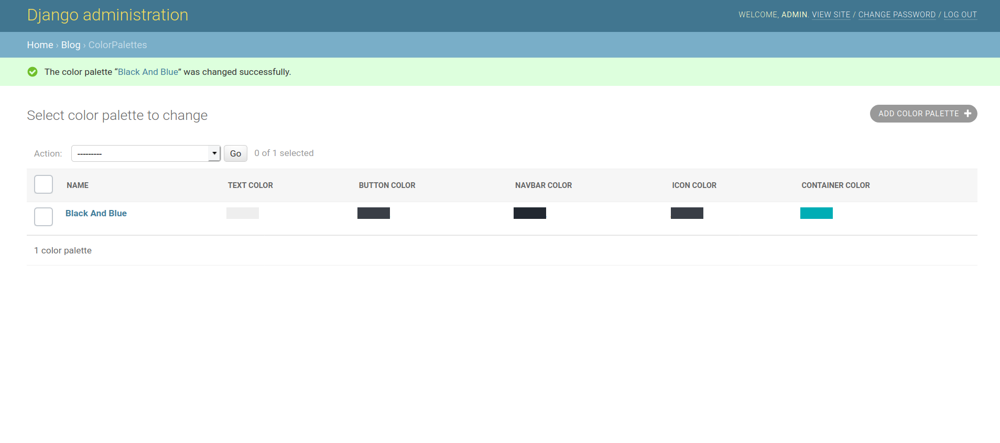

Fonts can be easily added via the admin portal and all of these can be chosen in the Settings model. You can find a list of web-safe fonts at https://websitesetup.org/web-safe-fonts-html-css/

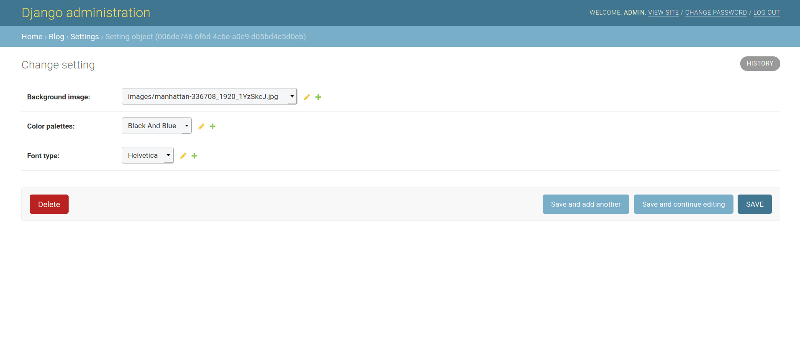

## Finally, we will tie our customizations into the templates using template injections.

### In base.html, the style section should be changed to this:

    

And, in the footer tag, at line 75, change:

    
Copyright &copy; Django Blog

to this:

    
Copyright &copy; Django Blog

### Next, we need to edit blog/views.py so the variables we are injecting are in the context. Note, we'll override the get_context function and then insure that kwargs are also added.

    from django.views import generic
    from .models import Post, Setting
    
    class PostList(generic.ListView):
        queryset = Post.objects.filter(status=1).order_by('-created_on')
        template_name = 'index.html'
        def get_context_data(self, **kwargs):
            settings = Setting.objects.all().first()
            context = {
                'background_image' : settings.background_image,
                'text_color' : str(settings.color_palettes.text_color),
                'button_color' : str(settings.color_palettes.button_color),
                'navbar_color' : str(settings.color_palettes.navbar_color),
                'font_type' : str(settings.font_type),
                'post_list' : self.queryset
    
            }
            for key in kwargs.keys():
                context[key] = kwargs[key]
    
            return context
    
    class PostDetail(generic.DetailView):
        model = Post
        template_name = 'post_detail.html'
    
        def get_context_data(self, **kwargs):
            settings = Setting.objects.all().first()
            context = {
                'background_image' : settings.background_image,
                'text_color' : str(settings.color_palettes.text_color),
                'button_color' : str(settings.color_palettes.button_color),
                'navbar_color' : str(settings.color_palettes.navbar_color),
                'font_type' : str(settings.font_type),
            }
            for key in kwargs.keys():
                context[key] = kwargs[key]
    
            return context

### Now our blog looks like this

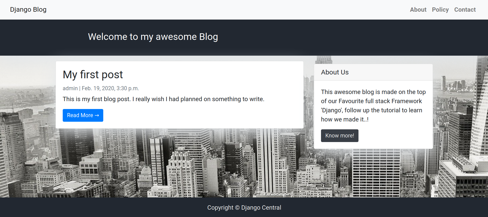

And customizations can easily be changed in the admin portal!

This completes the Django workshop!
