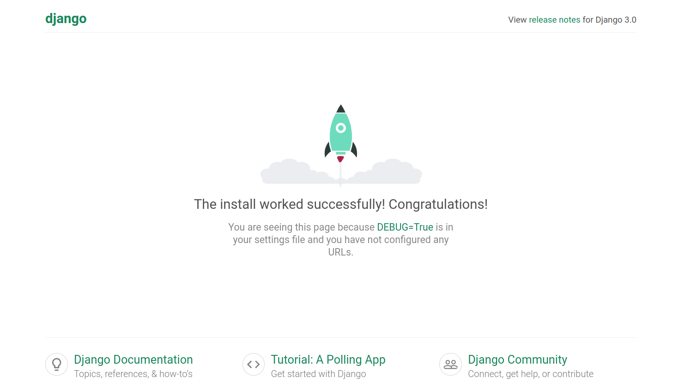
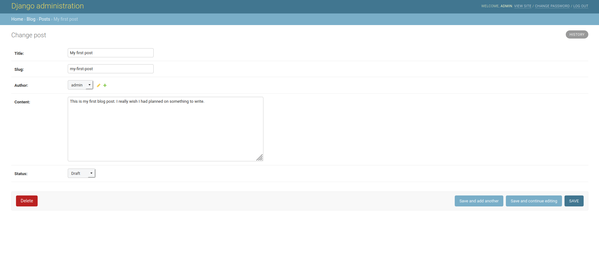
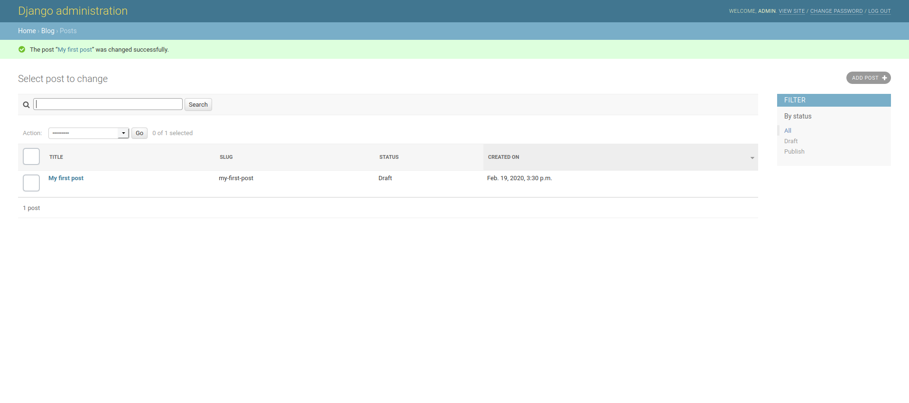

# Senior Career Day - Workshop2020
Today will be using the MVC framework of Django to build a simple blog website.

## Prerequisites
Make sure you have Python3 installed on your computer.

## Get Started
First, we will want to create a virtual environment so any dependencies that we install will be limited to that environment.

### On Windows
    cd Desktop
    virtualenv env
    cd env
    Scripts\activate.bat

### On Mac/Linux
    mkdir workshop2020
    cd workshop2020
    python3 -m venv .env
    source .env/bin/activate

## Install Django
    pip install Django
    
## Create Project
    cd ../
    mkdir website
    cd website
    django-admin startproject website
    
## Create the Blog app
    cd website
    python manage.py startapp blog
    
Your directory structure should look like this:

    ├── db.sqlite3
    ├── website
    │   ├── __init__.py
    │   ├── settings.py
    │   ├── urls.py
    │   ├── wsgi.py
    ├── manage.py
    └── blog
        ├── __init__.py
        ├── admin.py
        ├── apps.py
        ├── migrations
        │   └── __init__.py
        ├── models.py
        ├── tests.py
        └── views.py
    
## Add Blog app to settings.py

    INSTALLED_APPS = [
        'django.contrib.admin',
        'django.contrib.auth',
        'django.contrib.contenttypes',
        'django.contrib.sessions',
        'django.contrib.messages',
        'django.contrib.staticfiles',
        'blog'
    ]
    
### Migrate changes to the database
    python manage.py migrate

### Now let us test our site by running the server
    python manage.py runserver 0.0.0.0:8000
    
If you visit 0.0.0.0:8000 in your browser, you should see this:

### Now we need to define models in our database
    from django.db import models
    from django.contrib.auth.models import User

    STATUS = (
        (0,"Draft"),
        (1,"Publish")
    )

    class Post(models.Model):
        title = models.CharField(max_length=200, unique=True)
        slug = models.SlugField(max_length=200, unique=True)
        author = models.ForeignKey(User, on_delete= models.CASCADE,related_name='blog_posts')
        updated_on = models.DateTimeField(auto_now= True)
        content = models.TextField()
        created_on = models.DateTimeField(auto_now_add=True)
        status = models.IntegerField(choices=STATUS, default=0)

        class Meta:
            ordering = ['-created_on']

        def __str__(self):
            return self.title

#### And we need to migrate these changes
    python manage.py makemigrations
    python manage.py migrate

### Now we are going to edit the prebuilt admin portal, but first we need to create an admin account
    python manage.py createsuperuser
    
    Username (leave blank to use 'root'): admin
    Email address: admin@gamil.com
    Password: 
    Password (again):
    
### Visit the admin portal at 0.0.0.0:8000/admin
Log in using your credentials

Once you have logged in, you will see the admin portal

### Next we want to register our Post model with the admin portal. In blog/admin.py add the following:
    from django.contrib import admin
    from .models import Post 

    # customizes the appearance of our model in the admin view
    class PostAdmin(admin.ModelAdmin):
        list_display = ('title', 'slug', 'status','created_on')
        list_filter = ("status",)
        search_fields = ['title', 'content']
        prepopulated_fields = {'slug': ('title',)}

    # registers the model and its customizations with the admin portal
    admin.site.register(Post, PostAdmin)

Now, if we create a post, we will see it in our admin portal

### Next we will create our views. In blog/views.py add the following:
    from django.views import generic
    from .models import Post

    class PostList(generic.ListView):
        # Only show posts with a status=1, i.e. published
        queryset = Post.objects.filter(status=1).order_by('-created_on')
        template_name = 'index.html'

    class PostDetail(generic.DetailView):
        model = Post
        template_name = 'post_detail.html'

### Now, create a urls.py in the blog/ and add the following:
    from . import views
    from django.urls import path

    urlpatterns = [
        path('', views.PostList.as_view(), name='home'),
        path('<slug:slug>/', views.PostDetail.as_view(), name='post_detail'),
    ]

### Let us register our blog urls with admin urls in website/urls.py by adding the following:
    from django.contrib import admin
    from django.urls import path, include

    urlpatterns = [
        path('admin/', admin.site.urls),
        path('', include('blog.urls')),
    ]

### Next we will create our HTML templates. First, we will need to create a template directory and define it in website/settings.py
Create the templates directory at the same level as the project and app. Then, in website/settings.py,
Add

    TEMPLATES_DIR = os.path.join(BASE_DIR,'templates')

below BASE_DIR (around line number 17)

Add TEMPLATES_DIR to the 'DIRS' list in the TEMPLATES LIST (around line number 59)

    TEMPLATES = [
        {
            'BACKEND': 'django.template.backends.django.DjangoTemplates',
            #  Add  'TEMPLATE_DIRS' here
            'DIRS': [TEMPLATE_DIRS],
            'APP_DIRS': True,
            'OPTIONS': {
                'context_processors': [
                    'django.template.context_processors.debug',
                    'django.template.context_processors.request',
                    'django.contrib.auth.context_processors.auth',
                    'django.contrib.messages.context_processors.messages',
                ],
            },
        },
    ]
We want to create two templates. One that serves as a template for all other templates, i.e. includes navbars, footers, styling, etc.
We'll call it base.html:

    <!DOCTYPE html>
    <html>

        <head>
            <title>Django Central</title>
            <link href="https://fonts.googleapis.com/css?family=Roboto:400,700" rel="stylesheet">
            <meta name="google" content="notranslate" />
            <meta name="viewport" content="width=device-width, initial-scale=1" />
            <link rel="stylesheet" href="https://maxcdn.bootstrapcdn.com/bootstrap/4.0.0/css/bootstrap.min.css" integrity="sha384-Gn5384xqQ1aoWXA+058RXPxPg6fy4IWvTNh0E263XmFcJlSAwiGgFAW/dAiS6JXm"
                crossorigin="anonymous" />
        </head>

        <body>
            

            <!-- Navigation -->
            <nav class="navbar navbar-expand-lg navbar-light bg-light shadow" id="mainNav">
                

                    <a class="navbar-brand" href="">Django central</a>
                    <button class="navbar-toggler navbar-toggler-right" type="button" data-toggle="collapse" data-target="#navbarResponsive"
                        aria-controls="navbarResponsive" aria-expanded="false" aria-label="Toggle navigation">
                        
                    </button>
                    

                        <ul class="navbar-nav ml-auto">
                            <li class="nav-item text-black">
                                <a class="nav-link text-black font-weight-bold" href="#">About</a>
                            </li>
                            <li class="nav-item text-black">
                                <a class="nav-link text-black font-weight-bold" href="#">Policy</a>
                            </li>
                            <li class="nav-item text-black">
                                <a class="nav-link text-black font-weight-bold" href="#">Contact</a>
                            </li>
                        </ul>
                    

                

            </nav>
            
            <!-- Content Goes here -->
            
            

            

            <!-- Sidebar Widgets Column -->
            

            

                    <h5 class="card-header">About Us</h5>
                

                    
 This awesome blog is made on the top of our Favourite full stack Framework 'Django', follow up the tutorial to learn how we made it..!

                    <a href="https://djangocentral.com/building-a-blog-application-with-django"
                       class="btn btn-danger">Know more!</a>
                

            

            

    
            <!-- Footer -->
            <footer class="py-3 bg-grey">
                
Copyright &copy; Django Central

            </footer>
        </body>
    </html>

Next, we'll create the index.html, which will extend the base.html:

     
    
    

    <header class="masthead">
        

        

            

                

                    

                        <h3 class=" site-heading my-4 mt-3 text-white"> Welcome to my awesome Blog </h3>
                        
We Love Django As much as you do..! &nbsp
                        

                    

                

            

        

    </header>
    

        

            <!-- Blog Entries Column -->
            

                
                

                    

                        <h2 class="card-title">{{ post.title }}</h2>
                        
{{ post.author }} | {{ post.created_on}} 

                        
{{post.content|slice:":200" }}

                        <a href="" class="btn btn-primary">Read More &rarr;</a>
                    

                

                
            

        

    

    

Finally, we'll create the Post detail template.

     

    

      

        

          

            <h1> {{ object.title }} </h1>
            
{{ post.author }} | {{ post.created_on }}

            
{{ object.content | safe }}

          

        

      

    

    

